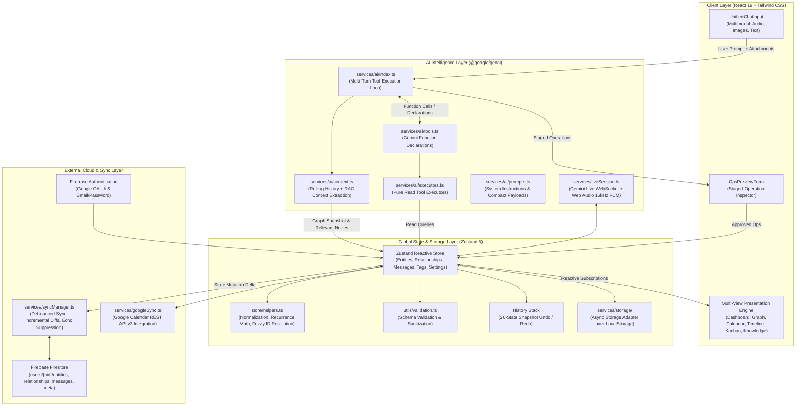

# Flowmate

> **A local-first, graph-native productivity system with agentic Gemini function calling, subcollection Firestore sync, and multi-view state visualization.**

[](https://flowmate-ai.web.app)
[](./LICENSE)
[](https://react.dev/)
[](https://www.typescriptlang.org/)
[](https://vitejs.dev/)
[](https://github.com/pmndrs/zustand)
[](./vitest.config.ts)

**Live Demo**: [https://flowmate-ai.web.app](https://flowmate-ai.web.app)

---

## Overview

Traditional productivity applications fragment personal management across rigid, disconnected silos: todo lists isolate tasks from their parent goals, calendars isolate events from project context, note-taking apps isolate documentation from active commitments, and habit trackers operate in complete isolation from daily schedules.

**Flowmate** solves this by structuring a user's entire life into an interconnected, directed property graph. Every goal, project, task, scheduled event, retrospective activity log, habit, note, context domain, personal contact, and promise is modeled as a unified **Entity node**, linked together through typed **Relationship edges** (`PART_OF`, `DEPENDS_ON`, `FULFILLS`, `SCHEDULED_FOR`, `TAGGED_WITH`, `PRECEDES`, `RELATED_TO`, `ASSIGNED_TO`).

Instead of manually navigating nested menus to wire relationships together, users interact naturally through a natural language chat interface. An **AI Orchestrator** powered by the official `@google/genai` SDK analyzes conversational prompts, queries local graph state through structured tool calls, and returns atomic transaction batches (the **TOON Protocol**) that execute against client state with full undo/redo capability, optimistic local storage, and granular subcollection cloud synchronization.

---

## Architectural Principles

1. **Local-First with Subcollection Cloud Replication**  
   The application operates completely offline without network latency. All state hydrates immediately from browser `localStorage` via a custom async adapter. When authenticated with Firebase, granular subcollections (`entities`, `relationships`, `messages`, `meta`) synchronize incrementally with debounced diffing, optimistic writes, and echo-suppression listeners.

2. **Graph-Native Domain Model**  
   All items share a normalized `Entity` schema. Hierarchies are modeled via explicit `parent_id` foreign keys and directional `Relationship` edges. Specialized capabilities (e.g., recurrence rules, habit streaks, subtask checklists, academic schedules) live in type-safe metadata envelopes.

3. **Deterministic Function Calling over Free-form JSON**  
   The AI Orchestrator does not generate arbitrary markdown or uncontrolled state mutations. It employs Gemini Native Function Calling (`AUTO` mode, bounded by a multi-turn tool resolution loop of up to 5 turns). Read tools query local snapshots without roundtrip mutations; state mutations are committed strictly through the `apply_changes` tool executing validated operations (`create_entity`, `update_entity`, `delete_entity`, `link_entities`, etc.).

4. **Human-in-the-Loop Safety Boundary**  
   AI-generated operational batches are queued into an interactive staged preview form (`OpsPreviewForm`) before execution. Users can inspect, edit individual parameters, approve, or reject operations prior to committing them to the state graph.

---

## System Architecture



---

## Core Features

### 1. Natural Language AI Orchestrator
- **Multi-Turn Function Calling**: Uses Google Gemini (`@google/genai`, default `gemini-3.8-flash`, configurable to `gemini-3.7-flash` or `gemini-3.1-pro-preview`) with native tool declarations:
  - `read_calendar`: Query scheduled commitments and deadlines within ISO date bounds.
  - `search_entities`: Semantic query across titles, descriptions, status, and tag sets.
  - `lookup_goals`: Retrieve goal progress percentages and subtask completion status.
  - `lookup_habits`: Query active streaks, completion records, and frequencies.
  - `lookup_food_history`: Query historical nutrition logs, vendors, and health observations.
  - `get_productivity_stats`: Calculate focus scores and productive minutes across date ranges.
  - `apply_changes`: Atomic write tool committing graph modifications.
- **Token-Optimized Operation Grammar**: The orchestrator accepts both full and short-alias operation signatures (`c` for `create_entity`, `u` for `update_entity`, `d` for `delete_entity`, `l` for `link_entities`, `s` for `add_subtask`, `f` for `log_food`, `log` for `log_to_entity`, `arc` for `archive_entity`).
- **Context Extraction & Compaction**: Prunes conversation history past a 12-message sliding window into a structured narrative summary. Filters active entities within a $\pm 7$-day temporal window plus top-10 keyword relevance matches.
- **Multimodal Ingestion**: Accepts text, device images (downscaled to $1024\times 1024$ JPEG via HTML5 Canvas to conserve tokens), audio files, and text/code files (`.txt`, `.md`, `.json`, `.csv`).

### 2. Interactive Graph Visualization (D3.js)
- **Force-Directed Network Engine**: Powered by `d3.forceSimulation`, `d3.zoom`, and `d3.drag`.
- **Dynamic Entity Styling**: Nodes are color-coded and dimensioned according to `EntityKind`. Context nodes exert stronger gravitational pull to act as natural structural anchors.
- **Direct Graph Manipulation**:
  - Drag nodes to manually pin or adjust positions.
  - Shift + drag from node to node to interactively forge directional relationship edges.
  - Right-click context menus to launch focus sessions, edit properties, toggle status, or delete nodes.
- **Adaptive Performance Scaling**: Detects graph scale and automatically steps down simulation fidelity (`getOptimizedConfig`):
  - *<100 nodes*: 60 FPS, full label rendering, baseline decay.
  - *100–299 nodes*: 30 FPS (32ms throttle), focused labels only.
  - *300–499 nodes*: 20 FPS (50ms throttle), maximum 500 edges rendered.
  - *500+ nodes*: 10 FPS (100ms throttle), edge-culling to top 300 prioritized links, aggressive simulation alpha decay.
- **Graph Topology Diagnostic Engine**: Graph analysis tools (`graphAnalyzer.ts`) execute Union-Find algorithms with path compression to find disconnected clusters, identify orphan nodes, spot missing context tags, and feed entity chunks into Gemini to automatically suggest corrective relationships.

### 3. Multi-View Productivity Interfaces
- **Unified Executive Dashboard**: Aggregates top-level KPI counters, AI Daily Briefing, 24-hour horizontal productivity distribution bar, annual momentum heatmap, active goal progress gauges, and tap-to-cycle past event confirmation cards.
- **Calendar Engine (`CalendarView.tsx`)**: Custom-built calendar implementation supporting Month, Week, Day, Agenda, and History views:
  - Exact time-block placement (1 pixel = 1 minute vertical scaling in day/week grids).
  - Drag-and-drop rescheduling across days and hours.
  - Recurrence engine calculating simple patterns (`DAILY`, `WEEKLY`, `MONTHLY`, `YEARLY`) and complex RFC-compliant RRULE strings up to 30 days ahead.
- **Interactive Kanban Board (`KanbanBoard.tsx`)**: Swimlane task board partitioned across `Backlog` (`PENDING`), `To Do` (`ACTIVE`), `In Progress` (`IN_PROGRESS`), and `Done` (`COMPLETED`) with native HTML5 drag-and-drop status mutations and inline task quick-creation.
- **Timeline & Gantt View (`TimelineView.tsx`)**: Horizontal zoomable Gantt-style schedule view auto-calculating date envelopes across tasks, projects, and events with auto-centering on today.
- **Knowledge Base & Library (`KnowledgeView.tsx`)**: Catalog view of notes, contexts, and tags with multi-entity range selection (Shift-click / Ctrl+A) for batch visibility toggling and an inline RAG semantic search engine (`queryKnowledgeBase`) synthesizing grounded answers exclusively from user notes.
- **Pomodoro Focus Timer (`FocusTimer.tsx`)**: Floating persistent countdown timer with auto-completion that automatically commits an `ACTIVITY` log with duration and productivity classification upon completion.
- **Food & Nutrition Tracker (`FoodTracker.tsx`)**: Tracks meals, calorie totals, spending (in ₹), meal type classifications (breakfast, lunch, dinner, snack), preparation sources (mess, ordered, homemade, outside), vendor frequency, and subjective health tags (`oily`, `light`, `protein-rich`, etc.).
- **Academic Attendance Tracker (`AttendanceTracker.tsx`)**: Tracks subject attendance against minimum threshold percentages, logging present/absent/cancelled sessions, and providing a dynamic class skip allowance calculator.
- **Micro-Habit & Streak System (`QuickStreaks.tsx` & `HabitCard.tsx`)**: One-tap daily streak counter for habits and external apps with confetti celebrations and Recharts trend visualizations.

### 4. Real-Time Voice Interaction (Gemini Live)
- **Live Bidirectional Audio Session (`liveSession.ts` & `LiveVoiceModal.tsx`)**:
  - Connects to Google GenAI Live WebSocket endpoints using the stable `gemini-3.8-live` audio-to-audio model.
  - Captures microphone input via the Web Audio API, downsampling raw `Float32` streams into 16-bit PCM at 16kHz transmitted as base64 audio frames.
  - Receives 24kHz PCM audio from Gemini and plays it back smoothly via Web Audio buffer scheduling.
  - Renders a live circular 40-bar frequency visualizer driven by an `AnalyserNode` render loop.
  - Real-time client-side function calling: Gemini Live directly executes `create_entity` and `log_activity` calls during live speech.

### 5. Cloud Replication & Data Portability
- **Granular Cloud Sync (`syncManager.ts` & `firestoreSync.ts`)**:
  - Replaces monolithic document dumps with granular per-entity subcollections (`/users/{uid}/entities/{id}`, `/users/{uid}/relationships/{id}`, `/users/{uid}/messages/{id}`, `/users/{uid}/meta/{id}`).
  - Debounced background sync (2-second quiet window) writes only entities modified since the last sync timestamp.
  - Chat messages bypass debounce for immediate write-through synchronization.
  - Echo suppression tracking ignores inbound snapshot updates for recently written local message IDs.
- **Google Calendar 2-Way Adapter (`googleSync.ts`)**: Authenticates using OAuth access tokens acquired via Firebase Google Auth (`calendar` and `calendar.events` scopes). Creates, updates, and imports events directly to and from Google Calendar with automatic 401 token refresh.
- **Full Data Portability**: Client-side single-click JSON backup export/import and structured Markdown documentation generator (`exportMarkdown.ts`).
- **Resilient Circuit Breaker & API Retry (`utils/apiRetry.ts`)**: Finite state machine (`CLOSED` $\rightarrow$ `OPEN` $\rightarrow$ `HALF_OPEN`) protecting against API saturation, backed by exponential backoff with jitter and client-side sliding window rate limiting (`utils/rateLimiter.ts`).

---

## Data Model & Types

Flowmate centers on two primary graph primitives defined in [`types.ts`](./types.ts):

### Entity
```typescript
interface Entity {
  id: string;                         // UUID v4
  kind: EntityKind;                   // Node kind discriminator
  title: string;                      // Primary display label
  description: string | null;         // Extended details / Markdown
  status: EntityStatus;               // PENDING | ACTIVE | IN_PROGRESS | COMPLETED | CANCELED | ARCHIVED
  priority: number;                   // Priority scale (1 to 5)
  start_time: string | null;          // ISO 8601 start timestamp
  end_time: string | null;            // ISO 8601 end timestamp
  deadline: string | null;            // ISO 8601 target deadline
  duration_minutes: number | null;    // Duration allocation
  recurrence: RecurrenceType;         // DAILY | WEEKLY | MONTHLY | YEARLY | null
  canonical_tags: string[];           // Denormalized string tag cache
  parent_id?: string | null;          // Direct parent reference for hierarchy
  metadata: Record<string, any>;      // Kind-specific metadata envelope
  created_at: string;                 // ISO 8601 timestamp
  updated_at: string;                 // ISO 8601 timestamp
}
```

### Entity Kinds (`EntityKind`)
| Kind | Primary Role | Metadata Extensions |
|---|---|---|
| `GOAL` | Long-term milestone objective | `progress` (0–100), `subtasks[]`, `milestones[]` |
| `PROJECT` | Multi-step initiative | `subtasks[]`, `completion_percentage` |
| `TASK` | Concrete actionable item | `subtasks[]`, `productivity` (PRODUCTIVE, NEUTRAL, UNPRODUCTIVE, SLEEP) |
| `EVENT` | Time-bound commitment | `rrule`, `location`, `gcal_id`, `gcal_link` |
| `ACTIVITY` | Historical work / focus log | Embedded inside metadata `activity_log[]` or standalone entity |
| `HABIT` | Recurring daily / weekly routine | `streak_current`, `streak_best`, `total_completions`, `habit_type` (GOOD/BAD) |
| `NOTE` | Static documentation / reference | `content_format` ('markdown' \| 'plain') |
| `TAG` | Categorization marker | `usage_count`, `color` |
| `CONTEXT` | Life sphere / domain anchor | Academics, Work, Health, Personal, Organization |
| `PERSON` | Social / professional contact | `category`, `organization`, `interaction_count`, `email`, `phone` |
| `PROMISE` | Interpersonal commitment | `original_statement`, `to_person_id`, `detected_at`, `due_date` |
| `OPPORTUNITY`| Potential prospect or lead | Stage tracking, target dates |
| `MINI_STREAK`| Lightweight daily check-in | `streak_current`, `streak_best`, `last_completed_at`, `app_name` |

### Relationships (`Relationship`)
```typescript
interface Relationship {
  id: string;
  from: string;               // Source entity ID
  to: string;                 // Target entity ID
  type: RelationshipType;     // Edge type
  meta: Record<string, any>;  // Edge metadata
  created_at: string;
}
```

**Edge Types**: `PART_OF` (structural hierarchy), `DEPENDS_ON` (blocking prerequisite), `FULFILLS` (action satisfying an objective), `SCHEDULED_FOR` (temporal link), `TAGGED_WITH` (tag/context association), `PRECEDES` (workflow sequence), `ASSIGNED_TO` (stakeholder link), `RELATED_TO` (general association).

---

## Tech Stack

| Domain | Technology | Version | Purpose in Codebase |
|---|---|---|---|
| **Core Framework** | React | `19.2.1` | Concurrent root rendering, hooks, transitions |
| **Language** | TypeScript | `~5.8.2` | Strict end-to-end type safety, discriminated unions |
| **Build & Tooling** | Vite | `^6.2.0` | ESM development server, rollup production chunking |
| **Styling** | Tailwind CSS | `^4.1.18` | `@theme` design tokens, custom utility animations |
| **State Management** | Zustand | `^5.0.9` | Unidirectional reactive store with `persist` middleware |
| **AI SDK** | Google GenAI SDK | `^1.31.0` | Gemini Function Calling (`@google/genai`) & Gemini Live |
| **Network Visualization** | D3.js | `^7.9.0` | Force simulations, SVG node/link canvas, zoom behaviors |
| **Cloud Database** | Firebase Firestore | `^12.6.0` | Granular user subcollections, realtime snapshot listeners |
| **Authentication** | Firebase Auth | `^12.6.0` | Google OAuth popup with Calendar scopes & Email/Password |
| **Iconography** | Lucide React | `^0.556.0` | Semantic interface iconography |
| **Charts** | Recharts | `^3.5.1` | Habit sparklines and trend charts |
| **Identifiers** | UUID | `^13.0.0` | Client-generated collision-free entity/relationship IDs |
| **Test Runner** | Vitest | `^4.0.16` | Fast unit test execution with jsdom integration |
| **Test Assertions** | Testing Library | `^16.3.1` | DOM testing utilities and `@testing-library/jest-dom` |

---

## Project Structure

```
flowmate-v3/
├── App.tsx                     # Main shell layout, view routing, chat pane, drag-drop
├── store.ts                    # Zustand store definition, state actions, migrations (v16)
├── types.ts                    # Domain ontology, EntityKind, RelationshipType, TOON types
├── index.tsx                   # React 19 createRoot mount, Service Worker registration
├── index.css                   # Tailwind v4 import, design tokens, layout animations
├── index.html                  # HTML entry point, PWA meta headers, font preconnects
├── vite.config.ts              # Vite configuration, vendor manual chunking, path aliases
├── vitest.config.ts            # Vitest unit test runner config, coverage rules
├── firebase.json               # Firebase hosting rewrites, cache headers, Firestore rules
├── firestore.rules             # Multitenant user-isolated Firestore security rules
├── .env.example                # Canonical environment variable specification
├── package.json                # Project dependencies, build and test scripts
│
├── components/                 # Presentation & interactive UI components
│   ├── Dashboard.tsx           # Executive dashboard, KPI counters, briefings, charts
│   ├── GraphView.tsx           # D3 force-directed knowledge graph visualization
│   ├── CalendarView.tsx        # Month, Week, Day, Agenda, History calendar engine
│   ├── KanbanBoard.tsx         # Drag-and-drop task workflow board
│   ├── TimelineView.tsx        # Horizontal Gantt schedule visualization
│   ├── KnowledgeView.tsx       # Notes, contexts, tag browser with inline RAG search
│   ├── EntityDetailPanel.tsx   # Property inspector, relationship manager, subtask editor
│   ├── CreateEntityModal.tsx   # Modal for manually creating any entity kind
│   ├── UnifiedChatInput.tsx    # Multimodal chat bar (Web Speech mic, file upload, text)
│   ├── OpsPreviewForm.tsx      # Staged operation review and parameter tuning modal
│   ├── GraphFixingModal.tsx    # AI graph topology repair wizard (orphans, clusters)
│   ├── FocusTimer.tsx          # Floating Pomodoro timer with activity log auto-commit
│   ├── FoodTracker.tsx         # Nutrition logging, spending metrics, vendor analytics
│   ├── AttendanceTracker.tsx   # Academic class attendance & skip calculator
│   ├── QuickStreaks.tsx        # Lightweight one-tap streak logging widget
│   ├── HabitCard.tsx           # Habit progress card with Recharts sparkline
│   ├── LiveVoiceModal.tsx      # Gemini Live voice modal with canvas audio visualizer
│   ├── AuthModal.tsx           # Firebase Google OAuth & Email/Password sign-in
│   ├── SettingsView.tsx        # Model selection, feature toggles, backups, deduping
│   ├── Sidebar.tsx             # Main navigation rail, XP level bar, sync status
│   ├── CommandPalette.tsx      # Command palette (Ctrl+K) for navigation and search
│   ├── ConnectionStatus.tsx    # Online/offline status banner and auto-reconnect sync
│   ├── ErrorBoundary.tsx       # Class error boundary with data export & state purge
│   ├── MarkdownText.tsx        # Regex-based safe Markdown parser with code copy buttons
│   ├── SmartEditor.tsx         # Note editor with Gemini grammar, polish, and expansion
│   ├── BadHabitAlert.tsx       # Proactive threshold warning for limit-exceeding habits
│   ├── ContributionHeatmap.tsx # 365-day GitHub-style green activity density heatmap
│   ├── MomentumHeatmap.tsx     # Annual duration-based blue hours heatmap
│   ├── DailyProductivityBar.tsx# 24-hour horizontal color-coded productivity timeline
│   ├── ProductivityChart.tsx   # Productive vs Neutral vs Downtime breakdown bars
│   ├── GoalProgressChart.tsx   # Circular SVG goal completion rings
│   ├── StreakLeaderboard.tsx   # Top habit streak leaderboard rankings
│   ├── WeeklyInsights.tsx      # Day-of-week and time-of-day focus analytics
│   ├── WeeklySummary.tsx       # Week-over-week comparative productivity delta
│   ├── ToastNotification.tsx   # Toast notification stack
│   ├── Confetti.tsx            # Canvas celebration particle physics
│   ├── Skeleton.tsx            # Animated shimmer skeletons for loading states
│   └── EmptyState.tsx          # Structured empty state illustrations and actions
│
├── services/                   # Business logic, synchronization, and AI engines
│   ├── ai/                     # Gemini AI Orchestrator subsystem
│   │   ├── client.ts           # GoogleGenAI instance initialization & retry policies
│   │   ├── index.ts            # orchestrateMessage, generateBriefing, queryKnowledgeBase
│   │   ├── tools.ts            # Gemini FunctionDeclaration tool schemas (FLOWMATE_TOOLS)
│   │   ├── executors.ts        # Pure read-only tool execution & relevance ranking
│   │   ├── context.ts          # History truncation, rolling summaries, RAG context
│   │   └── prompts.ts          # System prompt rules, shortcuts, food instructions
│   ├── storage/                # Local persistence abstractions
│   │   ├── index.ts            # Barrel exports
│   │   ├── LocalStorageAdapter.ts # Generic async storage wrapper
│   │   └── asyncStorageAdapter.ts # Zustand StateStorage implementation
│   ├── firebase.ts             # Firebase app initialization, Auth handlers, token management
│   ├── firestoreSync.ts        # Low-level Firestore subcollection CRUD, snapshot listeners
│   ├── syncManager.ts          # Debounced auto-sync, incremental diffs, echo suppression
│   ├── googleSync.ts           # Google Calendar REST API v3 event synchronization
│   ├── graphAnalyzer.ts        # Union-Find cluster detection, orphan & tag analysis
│   ├── liveSession.ts          # Gemini Live WebSockets, Web Audio 16kHz PCM audio
│   ├── notifications.ts        # HTML5 browser notification scheduler
│   └── haptics.ts              # Device vibration pattern wrapper
│
├── store/                      # Store helper routines
│   └── helpers.ts              # Payload normalization, recurrence math, fuzzy ID resolver
│
├── utils/                      # Pure functional helper utilities
│   ├── validation.ts           # Schema validation for entities, rels, operations, storage
│   ├── apiRetry.ts             # Exponential backoff, jitter, and Circuit Breaker FSM
│   ├── rateLimiter.ts          # Sliding window client-side API rate limiters
│   ├── debounce.ts             # Trailing debounce, leading throttle, double-click lock
│   ├── progressCalculation.ts  # Weighted subtask & child entity progress calculator
│   ├── streakCalculation.ts    # Consecutive day streak math, activity summaries
│   ├── graphPerformance.ts     # D3 dynamic throttle configs, link prioritization, culling
│   ├── graphVisibility.ts      # Stale/archived entity filtering & duplicate detection
│   ├── imageProcessing.ts      # Canvas downscaling (1024x1024), file MIME typing
│   ├── exportMarkdown.ts       # Structured Markdown export blob generation
│   └── accessibility.tsx       # Screen reader announcements, focus trapping, skip links
│
├── tests/                      # Vitest test suite (60 unit tests)
│   ├── setup.ts                # jsdom test setup, localStorage & crypto mock polyfills
│   ├── validation.test.ts      # Validation, sanitization, and attack mitigation tests
│   ├── apiRetry.test.ts        # Exponential backoff, retry rules, Circuit Breaker tests
│   └── graphPerformance.test.ts# D3 config optimization, link prioritization tests
│
└── public/                     # Static production assets
    ├── manifest.json           # PWA standalone manifest
    ├── sw.js                   # PWA Service Worker (cache-first static, offline navigation)
    ├── icon-192.png            # 192x192 PNG application icon
    └── icon-512.png            # 512x512 PNG application icon
```

---

## Getting Started

### Prerequisites
- **Node.js**: `v18.0.0` or higher (Node 20+ recommended)
- **Package Manager**: `npm` (v9+) or `pnpm`
- **Google Gemini API Key**: Required for AI orchestration ([Google AI Studio](https://aistudio.google.com/app/apikey))
- **Firebase Project** *(Optional)*: Required only for multi-device cloud synchronization and Google Calendar integration ([Firebase Console](https://console.firebase.google.com/))

### Installation

1. **Clone the repository**:
   ```bash
   git clone https://github.com/Suvichan2005/flowmate-v3.git
   cd flowmate-v3
   ```

2. **Install project dependencies**:
   ```bash
   npm install
   ```

3. **Configure Environment Variables**:
   Copy the example environment template to create a local configuration file:
   ```bash
   cp .env.example .env.local
   ```
   Open `.env.local` in an editor and insert your Gemini API Key:
   ```env
   VITE_GEMINI_API_KEY=AIzaSyYourGeminiApiKeyHere
   ```
   *(Firebase variables are optional for local development; if omitted, Flowmate operates fully in local-first offline mode).*

4. **Launch the development server**:
   ```bash
   npm run dev
   ```
   The application will boot at `http://localhost:3000` (or `http://localhost:5173` if port 3000 is occupied).

---

## Configuration & Environment Variables

All environment variables consumed by the client use Vite's `VITE_` prefix:

| Environment Variable | Required | Description |
|---|---|---|
| `VITE_GEMINI_API_KEY` | **Yes** | Google Gemini API key used by `@google/genai` for orchestration, daily briefings, text editing, and live voice sessions. |
| `VITE_FIREBASE_API_KEY` | Optional | Firebase Web API key for authentication and Firestore access. |
| `VITE_FIREBASE_AUTH_DOMAIN` | Optional | Firebase Auth domain (`<project-id>.firebaseapp.com`). |
| `VITE_FIREBASE_PROJECT_ID` | Optional | Firebase Google Cloud project identifier. |
| `VITE_FIREBASE_STORAGE_BUCKET` | Optional | Google Cloud Storage bucket URL (`<project-id>.appspot.com`). |
| `VITE_FIREBASE_MESSAGING_SENDER_ID` | Optional | Firebase Cloud Messaging numerical sender ID. |
| `VITE_FIREBASE_APP_ID` | Optional | Firebase Web Application registered ID. |
| `VITE_FIREBASE_MEASUREMENT_ID` | Optional | Google Analytics measurement ID (`G-XXXXXXXXXX`). |

---

## Cloud Sync & Firebase Setup

Cloud synchronization is optional. If unconfigured, the application runs fully locally with browser `localStorage`. To enable real-time replication across devices:

1. **Create a Firebase Project** in the [Firebase Console](https://console.firebase.google.com/).
2. **Enable Authentication**:
   - Enable **Google** provider (add your development domain to Authorized Domains).
   - *(Optional)* Enable **Email/Password** provider.
3. **Provision Firestore**:
   - Create a Cloud Firestore database in production mode.
   - Deploy the project security rules directly via the Firebase CLI:
     ```bash
     firebase deploy --only firestore:rules
     ```
     The security rules in [`firestore.rules`](./firestore.rules) ensure complete multi-tenant isolation, restricting reads and writes to authenticated documents where `request.auth.uid == userId`.
4. **Google Calendar Sync**:
   - In Google Cloud Console, navigate to **APIs & Services > Library**.
   - Enable the **Google Calendar API**.
   - Ensure the OAuth consent screen includes the `https://www.googleapis.com/auth/calendar` and `https://www.googleapis.com/auth/calendar.events` scopes.
5. Populate `.env.local` with the Firebase web application credentials from Project Settings.

---

## Verification & Testing

The test suite validates runtime schema integrity, data sanitization, API exponential backoff, circuit breaker state machines, and graph optimization algorithms:

```bash
# Execute unit test suite
npm run test:run

# Execute tests in watch mode
npm run test

# Generate test coverage report
npm run test:coverage
```

### Production Build Verification
To compile the production distribution bundle with Rollup chunk splitting:
```bash
npm run build
npm run preview
```

---

## License

This project is licensed under the MIT License — see the [LICENSE](./LICENSE) file for complete details.
