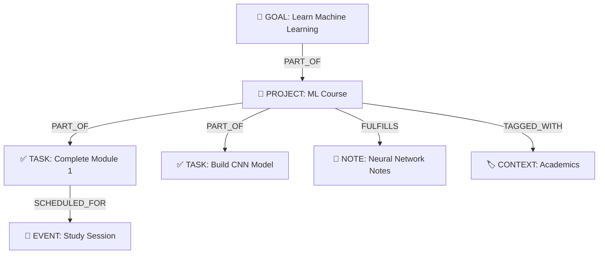

# Flowmate - Comprehensive Documentation

## Executive Summary

**Flowmate** is an AI-powered productivity orchestration platform that helps users manage their goals, projects, tasks, events, and knowledge through a graph-based data structure. The application uses Google's Gemini AI as the core intelligence layer to understand user intent and modify the productivity graph through natural language interactions.

---

## Core Concept: The Productivity Graph

Flowmate models productivity as a **graph of interconnected entities** rather than isolated lists:



---

## Key Features

| Feature | Description |
|---------|-------------|
| **AI Orchestrator** | Natural language chat interface powered by Gemini 2.5 Flash |
| **Graph Visualization** | Interactive D3.js-powered knowledge graph |
| **Multimodal Input** | Support for images, audio, and text attachments |
| **Live Voice Mode** | Real-time voice interaction with AI |
| **Focus Timer** | Pomodoro-style focus sessions with activity logging |
| **Knowledge Base** | AI-powered Q&A over personal notes with tag/context filtering |
| **Calendar View** | Drag-and-drop event scheduling with IST timezone support |
| **Gamification** | XP system and productivity levels |
| **Firebase Integration** | Cloud sync and authentication (Email/Password + Google OAuth) |
| **Data Portability** | JSON export/import of entire graph |

---

## Technology Stack

| Layer | Technology |
|-------|------------|
| **Frontend** | React 19 + TypeScript |
| **Styling** | TailwindCSS (via CDN) |
| **State Management** | Zustand with localStorage persistence |
| **AI Provider** | Google Gemini API (@google/genai) |
| **Graph Visualization** | D3.js |
| **Icons** | Lucide React |
| **Build Tool** | Vite |
| **Cloud Backend** | Firebase (Firestore + Auth) |

---

## Project Structure

```
flowmate/
├── App.tsx              # Main application shell
├── store.ts             # Zustand global state (920+ lines)
├── types.ts             # TypeScript type definitions
├── index.tsx            # React entry point
├── index.html           # HTML template with importmap
├── package.json         # Dependencies
├── components/          # 22 React components
│   ├── Dashboard.tsx    # Main dashboard view
│   ├── GraphView.tsx    # D3 graph visualization
│   ├── Sidebar.tsx      # Navigation sidebar
│   ├── AuthModal.tsx    # Firebase authentication UI
│   └── ...
├── services/            # AI and sync services
│   ├── geminiService.ts # Gemini API orchestration
│   ├── googleSync.ts    # Google Calendar adapter
│   ├── firebase.ts      # Firebase config & auth functions
│   ├── firestoreSync.ts # Firestore data sync
│   └── liveSession.ts   # Real-time voice AI
└── utils/
    ├── imageProcessing.ts # Multimodal file handling
    └── progressCalculation.ts # Entity progress calculation
```

---

## Quick Start

```bash
# Prerequisites: Node.js 18+

# Install dependencies
npm install

# Set API key (create .env.local)
echo "API_KEY=your_gemini_api_key" > .env.local

# Optional: Add Firebase config for cloud sync
echo "VITE_FIREBASE_API_KEY=your_firebase_key" >> .env.local
echo "VITE_FIREBASE_PROJECT_ID=your_project" >> .env.local

# Start development server
npm run dev
```

---

## Documentation Index

| Document | Description |
|----------|-------------|
| [01-structural-analysis.md](./01-structural-analysis.md) | File organization and module boundaries |
| [02-semantic-analysis.md](./02-semantic-analysis.md) | Domain model and type system |
| [03-functional-analysis.md](./03-functional-analysis.md) | Features and user workflows |
| [04-architecture-analysis.md](./04-architecture-analysis.md) | System design and data flow |
| [05-components-reference.md](./05-components-reference.md) | All 22 React components |
| [06-services-reference.md](./06-services-reference.md) | AI, sync, and utility services |

---

## Recent Updates (Dec 2025)

- **Timezone Fix**: AI now outputs dates with correct IST timezone offset (+05:30) instead of UTC
- **Knowledge Base**: Enhanced with tabs for All/Tags/Contexts, universal tag display with usage counts
- **Firebase Integration**: Added cloud sync and authentication (email/password + Google OAuth)
- **EntityDetailPanel**: Rebuilt with complete edit mode, subtask management, and relationship linking
