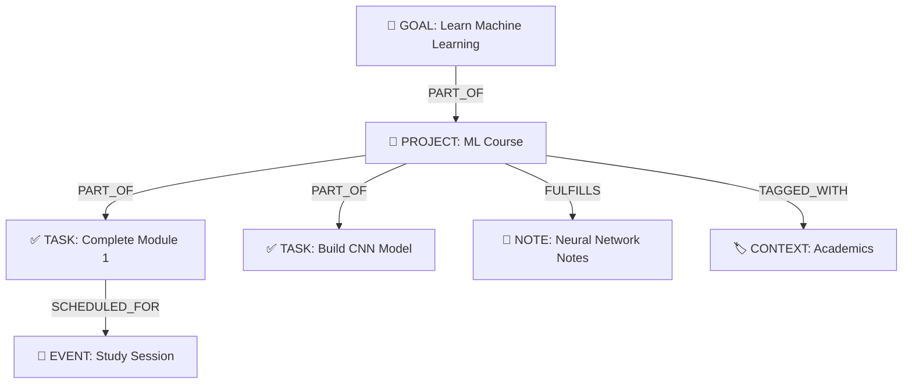

# Flowmate - Comprehensive Documentation

## Executive Summary

**Flowmate** is an AI-powered productivity orchestration platform that helps users manage their goals, projects, tasks, events, and knowledge through a graph-based data structure. The application uses Google's Gemini AI as the core intelligence layer to understand user intent and modify the productivity graph through natural language interactions.

---

## Core Concept: The Productivity Graph

Flowmate models productivity as a **graph of interconnected entities** rather than isolated lists:



---

## Key Features

| Feature | Description |
|---------|-------------|
| **AI Orchestrator** | Natural language chat interface powered by Gemini 2.5 Flash |
| **Graph Visualization** | Interactive D3.js-powered knowledge graph |
| **Multimodal Input** | Support for images, audio, and text attachments |
| **Live Voice Mode** | Real-time voice interaction with AI |
| **Focus Timer** | Pomodoro-style focus sessions with activity logging |
| **Knowledge Base** | AI-powered Q&A over personal notes with tag/context filtering |
| **Calendar View** | Drag-and-drop event scheduling with IST timezone support |
| **Food Tracking** | Full meal logging with vendor analytics and nutrition tracking |
| **Attendance Tracking** | Academic class attendance with skip calculator |
| **Quick Streaks** | Lightweight daily habit tracking with streak management |
| **Gamification** | XP system and productivity levels |
| **Firebase Integration** | Cloud sync and authentication (Email/Password + Google OAuth) |
| **Schedules & Food** | Dedicated tracking for class timetables (recurring) and mess menus |
| **Chat Channels** | Context-specific chat contexts (General, Schedules, Food, Finance) |
| **Data Portability** | JSON export/import of entire graph |
| **Graph Analysis** | Automated detection of orphans, duplicates, and issues |
| **Connection Status** | Real-time sync status indicator with auto-retry |

---

## Technology Stack

| Layer | Technology |
|-------|------------|
| **Frontend** | React 19 + TypeScript |
| **Styling** | TailwindCSS (via CDN) |
| **State Management** | Zustand with localStorage persistence |
| **AI Provider** | Google Gemini API (@google/genai) |
| **Graph Visualization** | D3.js |
| **Icons** | Lucide React |
| **Build Tool** | Vite |
| **Cloud Backend** | Firebase (Firestore + Auth) |

---

## Project Structure

```
flowmate-v3/
├── App.tsx              # Main application shell & chat logic (~38KB)
├── store.ts             # Zustand global state (~81KB, 2000+ lines)
├── types.ts             # TypeScript type definitions (~8.7KB)
├── index.tsx            # React entry point
├── index.css            # Global styles
├── index.html           # HTML template with importmap
├── package.json         # Dependencies
├── components/          # 42 React components
│   ├── Dashboard.tsx    # Main dashboard view (~47KB)
│   ├── GraphView.tsx    # D3 graph visualization (~41KB)
│   ├── CalendarView.tsx # Calendar with events (~53KB)
│   ├── EntityDetailPanel.tsx # Entity editor (~62KB)
│   ├── KnowledgeView.tsx # Notes/Tags browser (~33KB)
│   ├── AttendanceTracker.tsx # Academic attendance (~32KB)
│   ├── FoodTracker.tsx  # Food logging UI (~28KB)
│   ├── QuickStreaks.tsx # Streak management (~20KB)
│   └── ... (34 more components)
├── services/            # AI and sync services
│   ├── geminiService.ts # Gemini API orchestration (~29KB)
│   ├── googleSync.ts    # Google Calendar adapter (~18KB)
│   ├── graphAnalyzer.ts # Graph health analysis (~11KB)
│   ├── firebase.ts      # Firebase config & auth
│   ├── firestoreSync.ts # Firestore data sync
│   └── liveSession.ts   # Real-time voice AI
├── utils/               # Helper functions
│   ├── streakCalculation.ts # Streak & contribution data (~16KB)
│   ├── graphVisibility.ts   # Entity filtering logic (~6KB)
│   ├── imageProcessing.ts   # Multimodal file handling
│   ├── progressCalculation.ts # Entity progress calculation
│   └── exportMarkdown.ts    # Markdown export
└── public/              # Static assets (PWA)
    ├── manifest.json    # PWA manifest
    └── sw.js            # Service worker
```

---

## Quick Start

```bash
# Prerequisites: Node.js 18+

# Install dependencies
npm install

# Set API key (create .env.local)
echo "API_KEY=your_gemini_api_key" > .env.local

# Optional: Add Firebase config for cloud sync
echo "VITE_FIREBASE_API_KEY=your_firebase_key" >> .env.local
echo "VITE_FIREBASE_PROJECT_ID=your_project" >> .env.local

# Start development server
npm run dev
```

---

## Documentation Index

| Document | Description |
|----------|-------------|
| [01-structural-analysis.md](./01-structural-analysis.md) | File organization and module boundaries |
| [02-semantic-analysis.md](./02-semantic-analysis.md) | Domain model and type system |
| [03-functional-analysis.md](./03-functional-analysis.md) | Features and user workflows |
| [04-architecture-analysis.md](./04-architecture-analysis.md) | System design and data flow |
| [05-components-reference.md](./05-components-reference.md) | All 42 React components |
| [06-services-reference.md](./06-services-reference.md) | AI, sync, and utility services |
| [07-feature-roadmap.md](./07-feature-roadmap.md) | Implemented and planned features |
| [08-ideation-map.md](./08-ideation-map.md) | Master plan and philosophy |
| [FEATURE_IDEATION.md](./FEATURE_IDEATION.md) | Comprehensive feature specifications |
| [FLOWMATE_ROADMAP.md](./FLOWMATE_ROADMAP.md) | Detailed development roadmap |

---

## Recent Updates (Dec 2025)

- **Food Tracker**: Full-featured food logging UI with vendor analytics, meal patterns, and nutrition tracking
- **Attendance Tracker**: Complete academic attendance system with skip calculator and class schedules
- **Quick Streaks**: Enhanced streak management with inline forms and mobile-friendly UI
- **Connection Status**: Real-time sync indicator with auto-retry logic
- **Graph Analyzer**: Automated detection of orphan nodes, duplicates, and graph issues
- **Productivity Charts**: Visual analytics for productivity tracking
- **Calendar Enhancements**: Weekly view grid, quick event creation, improved mobile responsiveness
- **Mobile Polish**: Removed mobile bottom nav, fixed alignment issues, unified chat experience
- **Schedules View**: Dedicated view for Class Schedules (recurring events) and Mess Menus
- **Chat Channels**: Context-aware chat channels for General, Schedules, Food, and Finance
- **Firebase Integration**: Cloud sync and authentication (email/password + Google OAuth)
