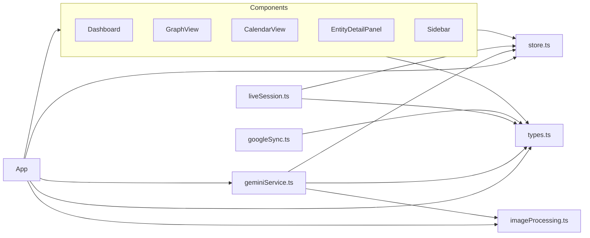

# Structural Analysis

This document provides a complete structural breakdown of the Flowmate codebase, detailing file organization, module boundaries, and file responsibilities.

---

## Directory Tree

```
c:/Users/.../copy-of-copy-of-copy-of-flowmate/
│
├── 📄 App.tsx                    [21,607 bytes] Main application component
├── 📄 index.tsx                  [349 bytes]    React DOM entry point
├── 📄 store.ts                   [26,300 bytes] Zustand state management
├── 📄 types.ts                   [3,120 bytes]  TypeScript type definitions
├── 📄 index.html                 [1,425 bytes]  HTML template
├── 📄 package.json               [560 bytes]    Dependencies
├── 📄 vite.config.ts             [580 bytes]    Vite configuration
├── 📄 tsconfig.json              [542 bytes]    TypeScript configuration
├── 📄 .env.local                 [35 bytes]     Environment variables
├── 📄 .gitignore                 [253 bytes]    Git ignore rules
├── 📄 README.md                  [553 bytes]    Project readme
├── 📄 metadata.json              [268 bytes]    Project metadata
│
├── 📁 components/                [21 files]     React UI components
│   ├── ActivityHeatmap.tsx       [4,380 bytes]  GitHub-style activity grid
│   ├── CalendarView.tsx          [9,667 bytes]  Monthly calendar with drag-drop
│   ├── CommandPalette.tsx        [8,717 bytes]  Cmd+K quick actions
│   ├── Confetti.tsx              [2,626 bytes]  Celebration animation
│   ├── CreateEntityModal.tsx     [7,758 bytes]  Entity creation form
│   ├── Dashboard.tsx             [18,134 bytes] Main dashboard view
│   ├── DebugConsole.tsx          [3,800 bytes]  Developer debug panel
│   ├── EntityDetailPanel.tsx     [34,949 bytes] Entity editor sidebar
│   ├── EntityList.tsx            [11,985 bytes] Filtered entity list view
│   ├── FocusTimer.tsx            [4,416 bytes]  Pomodoro-style timer
│   ├── GraphView.tsx             [25,941 bytes] D3 graph visualization
│   ├── KanbanBoard.tsx           [6,750 bytes]  Kanban board view
│   ├── KnowledgeView.tsx         [10,665 bytes] Knowledge base with AI Q&A
│   ├── LiveVoiceModal.tsx        [7,013 bytes]  Real-time voice interface
│   ├── MarkdownText.tsx          [7,930 bytes]  Markdown renderer
│   ├── PreviewModal.tsx          [3,013 bytes]  Operation confirmation
│   ├── SettingsView.tsx          [10,521 bytes] Settings panel
│   ├── Sidebar.tsx               [6,642 bytes]  Navigation sidebar
│   ├── SmartEditor.tsx           [4,967 bytes]  AI-enhanced text editor
│   ├── TimelineView.tsx          [9,008 bytes]  Timeline visualization
│   └── ToastNotification.tsx     [1,673 bytes]  Toast notifications
│
├── 📁 services/                  [3 files]      Backend services
│   ├── geminiService.ts          [12,073 bytes] Gemini AI orchestration
│   ├── googleSync.ts             [2,624 bytes]  Google Calendar sync
│   └── liveSession.ts            [9,505 bytes]  Real-time voice AI
│
└── 📁 utils/                     [1 file]       Utility functions
    └── imageProcessing.ts        [2,529 bytes]  Image/audio processing
```

---

## File Categories

### 1. Core Application Files

| File | Lines | Purpose |
|------|-------|---------|
| `App.tsx` | 527 | Root component; layout, chat interface, routing |
| `store.ts` | 715 | Global state management with Zustand |
| `types.ts` | 145 | Domain types, enums, interfaces |
| `index.tsx` | ~15 | React DOM render entry |

### 2. Component Files (21 total)

**View Components** (render full page views):
- `Dashboard.tsx` - Stats, briefing, activity heatmap
- `CalendarView.tsx` - Monthly calendar
- `KnowledgeView.tsx` - Notes browser with AI Q&A
- `EntityList.tsx` - Generic entity list
- `SettingsView.tsx` - User preferences

**Visualization Components**:
- `GraphView.tsx` - D3-powered force graph
- `KanbanBoard.tsx` - Status-based board
- `TimelineView.tsx` - Chronological timeline
- `ActivityHeatmap.tsx` - GitHub-style heatmap

**Modal Components**:
- `CreateEntityModal.tsx` - Entity creation
- `PreviewModal.tsx` - Operation confirmation
- `LiveVoiceModal.tsx` - Voice interface
- `EntityDetailPanel.tsx` - Entity editor (slide-over)
- `CommandPalette.tsx` - Quick actions overlay

**Utility Components**:
- `Sidebar.tsx` - Navigation
- `FocusTimer.tsx` - Focus session
- `DebugConsole.tsx` - Developer tools
- `ToastNotification.tsx` - Notifications
- `Confetti.tsx` - Celebration effects
- `MarkdownText.tsx` - Markdown parser
- `SmartEditor.tsx` - AI text editing

### 3. Service Files

| Service | Lines | Responsibility |
|---------|-------|----------------|
| `geminiService.ts` | 329 | AI orchestration, briefing, knowledge Q&A |
| `liveSession.ts` | 300 | WebSocket voice AI session |
| `googleSync.ts` | 74 | Calendar sync adapter (simulated) |

### 4. Utility Files

| Utility | Lines | Functions |
|---------|-------|-----------|
| `imageProcessing.ts` | 83 | Image resize, base64 encode, MIME detection |

---

## Import Dependency Graph



---

## Module Boundaries

### State Layer (`store.ts`)
- **Exports**: `useStore` hook
- **Contains**: All state, actions, persistence logic
- **Consumers**: App, all components, all services

### Type Layer (`types.ts`)
- **Exports**: Enums, interfaces, type aliases
- **Contains**: `Entity`, `Relationship`, `ToonOperation`, etc.
- **Consumers**: All files

### Service Layer (`services/`)
- **geminiService.ts**: Main AI logic
- **liveSession.ts**: Voice session manager
- **googleSync.ts**: External calendar sync
- **Consumers**: App, select components

### Component Layer (`components/`)
- **Organized by**: View vs Modal vs Utility
- **Data Flow**: Access state via `useStore`
- **Side Effects**: Call services for AI operations

---

## File Size Distribution

| Category | Total Lines | File Count |
|----------|-------------|------------|
| Store & Types | 860 | 2 |
| Main App | 527 | 1 |
| Components | ~4,500 | 21 |
| Services | 703 | 3 |
| Utils | 83 | 1 |
| **Total** | **~6,700** | **28** |

> **Note**: Line counts are approximate due to dynamic file viewing.
