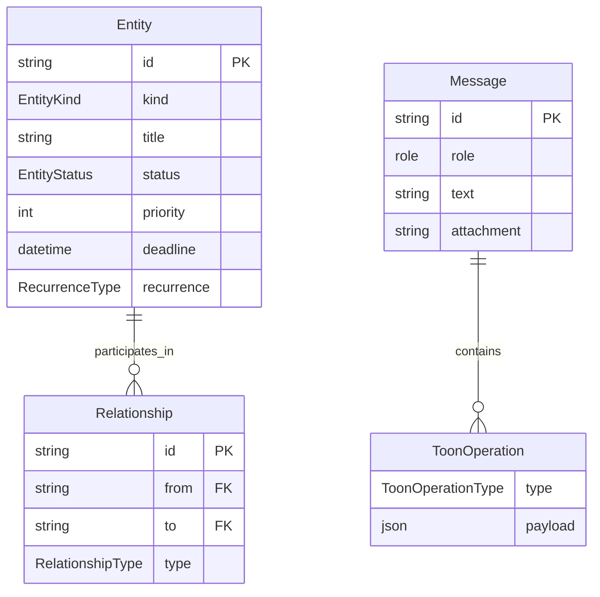

# Semantic Analysis

This document analyzes the **domain model** and **type system** of Flowmate, explaining the meaning and relationships between key abstractions.

---

## 1. Entity Domain Model

### 1.1 EntityKind Enum

Defines the 10 types of nodes in the productivity graph:

```typescript
export enum EntityKind {
  GOAL = 'GOAL',         // High-level objectives (e.g., "Learn Python")
  PROJECT = 'PROJECT',   // Multi-step initiatives
  COURSE = 'COURSE',     // Learning tracks
  TOPIC = 'TOPIC',       // Knowledge areas
  TASK = 'TASK',         // Actionable items
  EVENT = 'EVENT',       // Calendar entries
  ACTIVITY = 'ACTIVITY', // Logged work sessions
  ROLE = 'ROLE',         // User roles/responsibilities
  TAG = 'TAG',           // Classification labels
  NOTE = 'NOTE',         // Knowledge snippets
}
```

**Semantic Hierarchy**:
```
GOAL (strategic)
  └── PROJECT / COURSE (tactical)
        └── TASK / TOPIC (operational)
              └── ACTIVITY / EVENT (temporal)
                    └── NOTE (knowledge)
```

### 1.2 Entity Interface

```typescript
export interface Entity {
  id: string;                    // UUID v4 unique identifier
  kind: EntityKind;              // Type classification
  title: string;                 // Display name
  description: string | null;    // Optional details
  status: EntityStatus;          // Lifecycle state
  priority: number;              // 1-5 importance scale
  start_time: string | null;     // ISO8601 start datetime
  end_time: string | null;       // ISO8601 end datetime
  deadline: string | null;       // Due date for tasks/goals
  duration_minutes: number | null;  // Time estimate
  recurrence: RecurrenceType;    // DAILY|WEEKLY|MONTHLY|YEARLY|null
  metadata: Record<string, any>; // Extensible properties
  created_at: string;            // Creation timestamp
  updated_at: string;            // Last modification
  canonical_tags: string[];      // Tag references
}
```

### 1.3 EntityStatus Enum

```typescript
export enum EntityStatus {
  PENDING = 'PENDING',       // Not yet started
  ACTIVE = 'ACTIVE',         // Currently in progress
  IN_PROGRESS = 'IN_PROGRESS', // Alternative active state
  COMPLETED = 'COMPLETED',   // Successfully finished
  CANCELED = 'CANCELED',     // Abandoned
  ARCHIVED = 'ARCHIVED',     // Hidden from active views
}
```

---

## 2. Relationship Model

### 2.1 RelationshipType Enum

Defines 7 types of edges connecting entities:

```typescript
export enum RelationshipType {
  FULFILLS = 'FULFILLS',         // Activity → Goal (contributes to)
  PART_OF = 'PART_OF',           // Task → Project (containment)
  PRECEDES = 'PRECEDES',         // Task A → Task B (ordering)
  DEPENDS_ON = 'DEPENDS_ON',     // Task → Dependency (blocker)
  SCHEDULED_FOR = 'SCHEDULED_FOR', // Task → Event (time binding)
  TAGGED_WITH = 'TAGGED_WITH',   // Entity → Tag (classification)
  ASSIGNED_TO = 'ASSIGNED_TO',   // Task → Role (responsibility)
}
```

### 2.2 Relationship Interface

```typescript
export interface Relationship {
  id: string;                    // UUID v4
  from: string;                  // Source entity ID
  to: string;                    // Target entity ID
  type: RelationshipType;        // Edge classification
  meta: Record<string, any>;     // Extensible metadata
  created_at: string;            // Creation timestamp
}
```

**Graph Semantics**:
- **Directed**: Relationships flow FROM → TO
- **Labeled**: Type defines the semantic meaning
- **Unique**: No duplicate edges (from, to, type) combinations

---

## 3. TOON (Token-Oriented Object Notation)

TOON is the **operation protocol** for modifying the graph. AI responses return TOON operations.

### 3.1 Operation Types

```typescript
export type ToonOperationType = 
  | 'create_entity'     // Add new node
  | 'update_entity'     // Modify existing node
  | 'delete_entity'     // Remove node (and its edges)
  | 'link_entities'     // Create relationship
  | 'unlink_entities'   // Remove relationship
  | 'set_goal_progress' // Update goal metrics
  | 'log_activity'      // Create activity + link
  | 'schedule_event'    // Create/update calendar event
  | 'tag_update';       // Update entity tags
```

### 3.2 ToonOperation Interface

```typescript
export interface ToonOperation {
  type: ToonOperationType;
  payload: Record<string, any>;  // Operation-specific data
}
```

### 3.3 Payload Schemas by Type

| Operation | Required Payload Keys |
|-----------|----------------------|
| `create_entity` | `kind`, `title`, `description?`, `deadline?`, `priority?` |
| `update_entity` | `id`, `fields: { status?, title?, description? }` |
| `delete_entity` | `id` |
| `link_entities` | `from`, `to`, `type` |
| `unlink_entities` | `from`, `to`, `type` |
| `log_activity` | `title`, `duration_minutes?`, `linked_entity_id?` |
| `schedule_event` | `title`, `start_time`, `end_time?` |
| `set_goal_progress` | `goal_id`, `minutes?`, `percent?`, `note?` |
| `tag_update` | `entity_id`, `tags: string[]` |

### 3.4 ToonResponse Format

AI responses follow this structure:

```typescript
export interface ToonResponse {
  ops: ToonOperation[];      // 0+ operations to apply
  assistant: ToonAssistant;  // Chat message response
}

export interface ToonAssistant {
  message: string;           // Natural language response
  tone: string;              // "helpful", "error", etc.
  follow_up: string[];       // Suggested next questions
}
```

---

## 4. Message Model

### 4.1 Message Interface

```typescript
export interface Message {
  id: string;
  created_at: string;
  role: 'user' | 'assistant' | 'system';
  text: string;
  attachment?: string | null;      // Base64 image/audio
  ops_preview?: ToonOperation[];   // Pending operations
  structured?: any;                // Parsed data (future)
}
```

---

## 5. Supporting Types

### 5.1 RecurrenceType

```typescript
export type RecurrenceType = 'DAILY' | 'WEEKLY' | 'MONTHLY' | 'YEARLY' | null;
```

### 5.2 ViewType

```typescript
export type ViewType = 
  | 'dashboard' 
  | 'chat_graph' 
  | 'goals' 
  | 'projects' 
  | 'knowledge' 
  | 'calendar' 
  | 'settings';
```

### 5.3 UserSettings

```typescript
export interface UserSettings {
  timezone: string;              // e.g., "Asia/Kolkata"
  preferred_model: string;       // e.g., "gemini-2.5-flash"
  sync_enabled: boolean;         // Google Calendar sync
  debug_mode: boolean;           // Show debug console
  custom_instructions?: string;  // AI persona customization
}
```

### 5.4 FocusSession

```typescript
export interface FocusSession {
  entityId: string;              // Entity being focused on
  startTime: string;             // ISO8601 start
  durationMinutes: number;       // Target duration
  status: 'active' | 'paused' | 'completed';
}
```

### 5.5 DailyBriefing

```typescript
export interface DailyBriefing {
  content: string;               // Markdown briefing text
  timestamp: string;             // Generation time
  generated_for_date: string;    // Target date
}
```

### 5.6 Toast Notification

```typescript
export interface Toast {
  id: string;
  message: string;
  type: 'success' | 'error' | 'info';
}
```

---

## 6. Semantic Relationships Diagram



---

## 7. Key Semantic Rules

1. **Entity IDs** are UUID v4 strings, auto-generated
2. **Timestamps** are always ISO8601 format
3. **Status transitions** should follow: PENDING → ACTIVE → COMPLETED
4. **Completing recurring entities** auto-generates the next instance
5. **Deleting entities** cascades to remove orphaned relationships
6. **ACTIVITY entities** are always created with status COMPLETED
7. **EVENT entities** use `start_time`/`end_time`, not `deadline`
