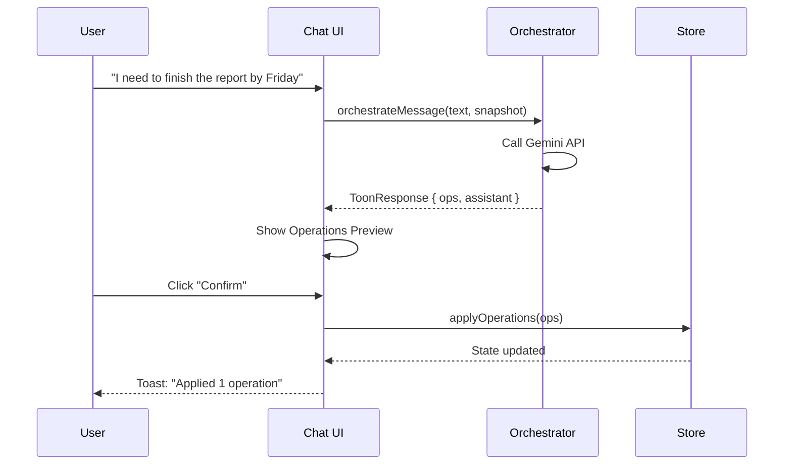
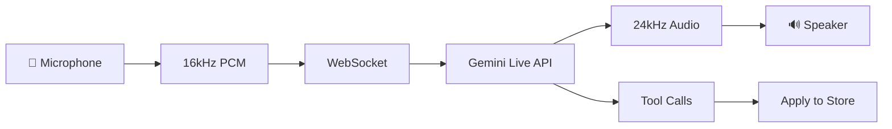

# Functional Analysis

This document details the **features and user workflows** in Flowmate, explaining what users can do and how the system responds.

---

## 1. Core Workflows

### 1.1 Chat-Based Entity Creation

**Flow**: User types natural language → AI interprets → Operations generated → User confirms → Graph updated



**Example Messages**:
| User Input | AI Operation |
|------------|--------------|
| "Create a goal to learn Python" | `create_entity { kind: GOAL, title: "Learn Python" }` |
| "Mark the report task as done" | `update_entity { id: xxx, fields: { status: COMPLETED }}` |
| "Schedule a meeting tomorrow at 3pm" | `schedule_event { title: "Meeting", start_time: "..." }` |
| "Link the design doc to Project X" | `link_entities { from: doc_id, to: project_id, type: PART_OF }` |

---

### 1.2 Multimodal Input (Images & Audio)

**Supported Inputs**:
- **Images**: Screenshots, diagrams, handwritten notes
- **Audio**: Voice memos (up to ~5MB)

**Processing Flow**:
1. User attaches file via paperclip button or drag-drop
2. `imageProcessing.ts` compresses to base64
3. Gemini receives as inline data
4. AI analyzes content and generates operations

**Example**:
```
User attaches: photo of whiteboard with TODO list
AI Response: "I see 4 tasks on your whiteboard. Creating them now..."
Operations: [create_entity × 4]
```

---

### 1.3 Live Voice Mode

**Real-time bidirectional voice conversation with AI**:



**Features**:
- Real-time audio visualization (frequency bars)
- Live transcription display
- Tool calls executed immediately
- Session can be ended anytime

---

## 2. View-Specific Features

### 2.1 Dashboard View

| Feature | Description |
|---------|-------------|
| **Stats Cards** | Entity counts, completion rates |
| **Daily Briefing** | AI-generated summary of focus areas |
| **Activity Heatmap** | GitHub-style contribution grid |
| **Quick Actions** | Fast navigation to common tasks |
| **Overdue Alerts** | Entities past deadline |

### 2.2 Graph View

| Feature | Description |
|---------|-------------|
| **Force Layout** | D3 physics simulation |
| **Node Filtering** | Toggle entity kinds |
| **Zoom/Pan** | Mouse wheel + drag |
| **Context Menu** | Right-click actions (Edit, Delete, Focus) |
| **Linking Mode** | Shift+click to create relationships |
| **Node Coloring** | By kind (indigo=GOAL, emerald=TASK, etc.) |
| **Status Indication** | Completed nodes show checkmark |

### 2.3 Calendar View

| Feature | Description |
|---------|-------------|
| **Month Navigation** | Previous/Next/Today buttons |
| **Drag-Drop Reschedule** | Move events between days |
| **Click to Create** | Quick event creation |
| **Color Coding** | Events vs Tasks with deadlines |
| **Day Events List** | Click day to see all items |

### 2.4 Knowledge View

| Feature | Description |
|---------|-------------|
| **Note Browser** | Filter by tags, search |
| **AI Q&A** | Ask questions about your notes |
| **Quick Create** | New note button |
| **Markdown Preview** | Rendered note content |

### 2.5 Goals/Projects Views

| Feature | Description |
|---------|-------------|
| **Progress Bars** | Based on child task completion |
| **Status Filters** | Active, Completed, All |
| **View Modes** | Grid, Kanban, Timeline |
| **Entity Cards** | Click to edit |

### 2.6 Settings View

| Feature | Description |
|---------|-------------|
| **AI Model** | Select preferred Gemini model |
| **Custom Instructions** | Personalize AI behavior |
| **Debug Mode** | Show debug console |
| **Export** | Download JSON backup |
| **Import** | Restore from JSON |
| **Reset** | Clear all data |

---

## 3. Command Palette (Cmd+K)

Quick actions accessible via keyboard shortcut:

| Command | Action |
|---------|--------|
| `Go to Dashboard` | Navigate to dashboard |
| `Go to Calendar` | Navigate to calendar |
| `Create Task` | Open create modal |
| `Ask AI...` | Send query to orchestrator |
| Search entities | Filter and select |

---

## 4. Focus Timer

**Pomodoro-style focus sessions**:

1. User clicks "Focus" on any entity
2. Timer starts (default 25 minutes)
3. Progress bar and countdown shown
4. User can pause/resume
5. On completion:
   - Activity logged automatically
   - Confetti celebration
   - Optional: Mark entity complete

---

## 5. Gamification System

**XP Calculation**:
```typescript
GOAL completed     → +200 XP
PROJECT completed  → +100 XP
TASK completed     → +20 XP
ACTIVITY logged    → +10 XP
Other entities     → +5 XP
```

**Level Formula**:
```typescript
level = Math.floor(Math.sqrt(xp / 100)) + 1
```

**UI Display**:
- Level badge in sidebar
- XP progress bar
- Confetti on level-up (implicit)

---

## 6. Undo/Redo System

**History Stack**:
- Stores last 20 snapshots
- Each `applyOperations` call adds snapshot
- Undo: Restore previous snapshot
- Redo: Move forward in history

**Keyboard Shortcuts**:
| Shortcut | Action |
|----------|--------|
| `Cmd+Z` | Undo (planned) |
| `Cmd+Shift+Z` | Redo (planned) |

---

## 7. Data Persistence

**LocalStorage Persistence** via Zustand middleware:

```typescript
{
  name: 'flowmate-storage',
  version: 11,
  migrate: (state, version) => { ... }
}
```

**Stored Data**:
- All entities
- All relationships
- Chat messages
- User settings
- Focus session state
- Daily briefing cache

---

## 8. Sync Queue (Background)

Operations are queued for external sync:

```typescript
interface SyncQueueItem {
  id: string;
  op: ToonOperation;
  status: 'pending' | 'in_progress' | 'failed' | 'done';
  attempts: number;
  created_at: string;
}
```

**Current Implementation**: Simulated Google Calendar sync (no real API calls)

---

## 9. Error Handling

| Scenario | Behavior |
|----------|----------|
| AI API failure | Toast error, empty ops returned |
| Invalid operation | Logged to debug console, skipped |
| Missing entity ID | Operation rejected with error |
| Sync failure | Retry with exponential backoff (planned) |
