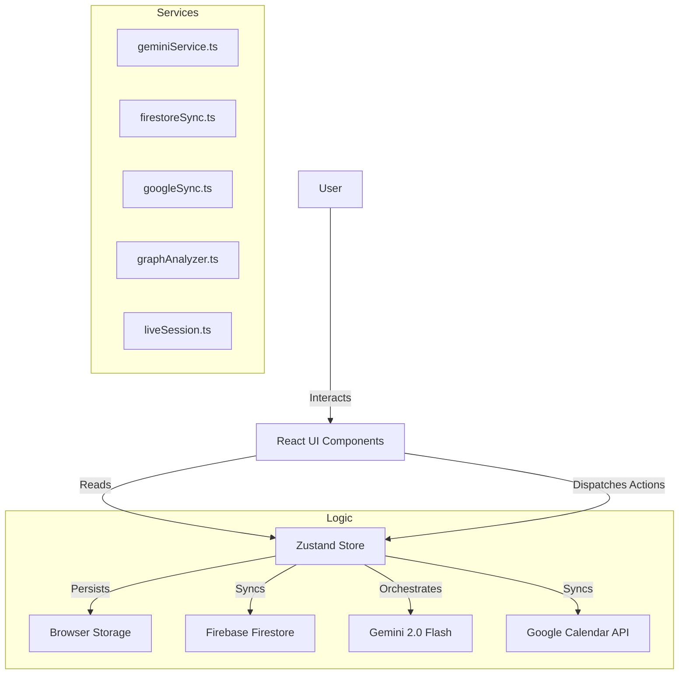

# Architecture Analysis

This document details the system design, data flow, and technical decisions.

## System Architecture

## State Management (Single Source of Truth)

The application uses **Zustand** as the central store.

*   **Store File**: `store.ts` (~81KB, 2000+ lines)
*   **State Structure**:
    *   `entities[]`: Flat list of all nodes
    *   `relationships[]`: Flat list of all edges
    *   `messages[]`: Chat history (field-partitioned by `channelId`)
    *   `settings`: User preferences and feature toggles
    *   `foodLogs[]`: Food tracking entries
    *   `subjects[]`: Academic subjects
    *   `attendanceLogs[]`: Attendance records
    *   `focusSession`: Current focus timer state
    *   `syncStatus`: Connection and sync state

## Data Flow: The "Toon" Loop

1.  **Trigger**: User sends a message.
2.  **Context Assembly**: The system gathers relevant Entities (Simple RAG) + Recent Chat History.
3.  **LLM Call**: The `geminiService` sends this context to Google Gemini with a specialized System Prompt defining the "Toon" tools.
4.  **Structured Output**: Gemini returns a JSON object containing `ops` (operations) and `assistant` (text).
5.  **Application**: `store.applyOperations(ops)` runs. This function contains the business logic (CRUD, linking, validation).
6.  **Reactivity**: React components subscribe to Store changes and re-render the Graph/List/Dashboard.
7.  **Sync**: If online and authenticated, changes sync to Firestore in background.

## External Integrations

### Gemini (AI)
*   Access via `@google/genai` SDK.
*   Uses `gemini-3-flash` (or configured model).
*   Tools are defined not as function calls (to avoid roundtrips) but as a structured JSON schema the model must adhere to.
*   **Live Voice**: WebSocket connection for real-time voice via `liveSession.ts`.

### Firebase (Cloud)
*   **Auth**: Google Sign-In / Email Password.
*   **Firestore**: Document database.
    *   Collection `users/{uid}/data/main` stores the massive JSON blob of the user graph.
    *   *Note*: Currently uses a "Snapshot Sync" (save/load entire state). Granular sync is in the roadmap.
*   **Connection Status**: Real-time monitoring with auto-retry.

### Google Calendar
*   Direct API usage via Google Identity Services (Client-side token).
*   Maps `EntityKind.EVENT` to GCal Events.
*   Stores `metadata.gcal_id` to maintain link.

## View Architecture

The central `App.tsx` switches `currentView` to render the main content area:

| View ID | Component |
|---------|-----------|
| `dashboard` | `Dashboard.tsx` |
| `chat_graph` | `GraphView.tsx` (with overlay chat) |
| `schedules` | `SchedulesView.tsx` |
| `calendar` | `CalendarView.tsx` |
| `knowledge` | `KnowledgeView.tsx` |
| `goals` | `EntityList.tsx` (filtered) |
| `projects` | `EntityList.tsx` (filtered) |
| `habits` | `QuickStreaks.tsx` |
| `food` | `FoodTracker.tsx` |
| `attendance` | `AttendanceTracker.tsx` |
| `analytics` | `AnalyticsView.tsx` |
| `settings` | `SettingsView.tsx` |

Sidebar and Chat Overlay (Orchestrator) are global persistent elements.

## Service Layer

| Service | Responsibilities |
|---------|------------------|
| `geminiService.ts` | LLM orchestration, prompt engineering, knowledge base queries |
| `firestoreSync.ts` | Cloud persistence, save/load, connection monitoring |
| `googleSync.ts` | Google Calendar API, OAuth, event mapping |
| `graphAnalyzer.ts` | Orphan detection, duplicate detection, graph health metrics |
| `liveSession.ts` | WebSocket for voice AI, audio streaming |
| `firebase.ts` | Firebase initialization, auth wrappers |

## Utility Layer

| Utility | Responsibilities |
|---------|------------------|
| `streakCalculation.ts` | Streak data, contribution graphs, aggregations |
| `graphVisibility.ts` | Filter logic for archived/old/orphan entities |
| `progressCalculation.ts` | Project/goal completion percentage |
| `imageProcessing.ts` | Image compression, base64 encoding |
| `exportMarkdown.ts` | Graph export to Markdown format |
