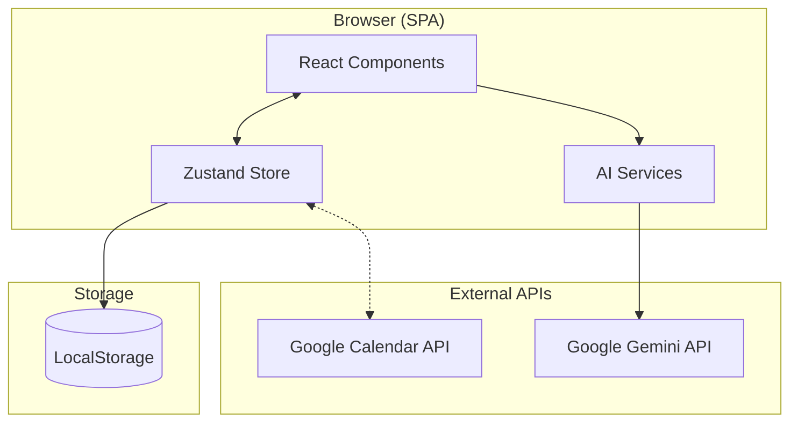
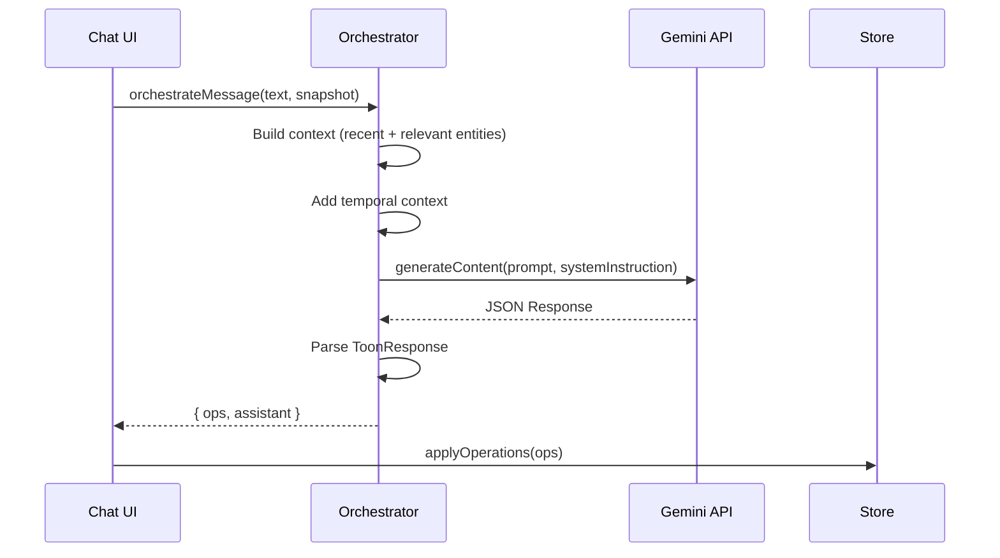
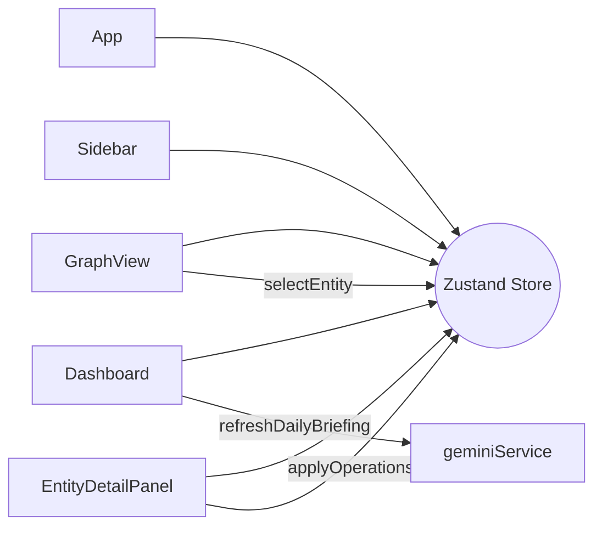
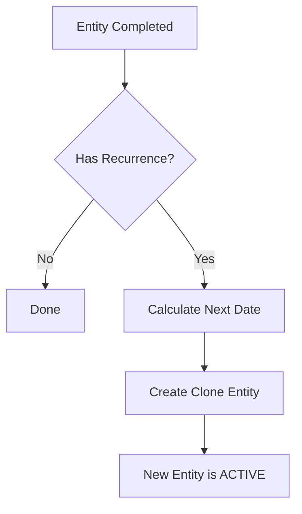

# Architecture Analysis

This document explains the **system design**, **data flow patterns**, and **architectural decisions** in Flowmate.

---

## 1. High-Level Architecture



**Architecture Style**: Client-only SPA with AI-as-Backend

---

## 2. Core Design Patterns

### 2.1 Flux-like Unidirectional Data Flow

```
User Action → Orchestrator → TOON Operations → Store → UI Update
```

- **No direct mutations**: All state changes via operations
- **Single source of truth**: Zustand store
- **Preview before commit**: Users confirm AI-generated operations

### 2.2 Command Pattern (TOON Operations)

Operations are serializable command objects:

```typescript
interface ToonOperation {
  type: ToonOperationType;  // The command
  payload: Record<string, any>;  // Parameters
}
```

This enables:
- Undo/redo via operation replay
- Sync queue for external services
- Debug logging of all mutations

### 2.3 Observer Pattern (React + Zustand)

Components subscribe to store slices:

```typescript
const { entities, selectEntity } = useStore(state => ({
  entities: state.entities,
  selectEntity: state.selectEntity
}));
```

---

## 3. State Management Architecture

### 3.1 Store Structure

```typescript
interface FlowmateState {
  // Domain Data
  entities: Entity[];
  relationships: Relationship[];
  messages: Message[];
  
  // Pending State
  pendingOps: { ops: ToonOperation[], messageId: string } | null;
  syncQueue: SyncQueueItem[];
  
  // UI State
  currentView: ViewType;
  selectedEntityId: string | null;
  isZenMode: boolean;
  toasts: Toast[];
  showConfetti: boolean;
  
  // User Data
  settings: UserSettings;
  focusSession: FocusSession | null;
  dailyBriefing: DailyBriefing | null;
  
  // History
  history: HistorySnapshot[];
  historyPointer: number;
  
  // Derivation
  debugLogs: DebugLogEntry[];
}
```

### 3.2 Action Categories

| Category | Actions |
|----------|---------|
| **CRUD** | `applyOperations`, `selectEntity` |
| **Navigation** | `setView`, `toggleZenMode` |
| **Settings** | `updateSettings`, `importData` |
| **AI Features** | `refreshDailyBriefing`, `startFocusSession` |
| **History** | `undo`, `redo` |
| **UI Feedback** | `addToast`, `triggerConfetti` |
| **Debug** | `addDebugLog`, `clearDebugLogs` |

### 3.3 Persistence Middleware

```typescript
persist(storeConfig, {
  name: 'flowmate-storage',
  version: 11,
  storage: createJSONStorage(() => localStorage),
  migrate: (state, version) => { ... },
  onRehydrateStorage: () => (state) => state?.setHydrated(true)
})
```

---

## 4. AI Integration Architecture

### 4.1 Orchestrator Pattern

The `geminiService.ts` acts as the central AI coordinator:



### 4.2 Context Window Management

To avoid token limits, context is pruned:

```typescript
const recentLimit = 8;    // Most recently updated
const relevantLimit = 6;  // Highest relevance score

// Relevance scoring
function calculateRelevance(entity, userMessage): number {
  // +5 for title match
  // +3 for tag match
  // +2 for recent updates
  // +1 for description/kind match
}
```

### 4.3 System Prompt Engineering

Key system instruction components:

1. **Role Definition**: "You are Flowmate Orchestrator v1"
2. **Schema Definitions**: All TOON operation payloads
3. **Hallucination Prevention**: "Do NOT invent operations when unsure"
4. **Output Format**: "Return ONLY valid JSON"
5. **Custom Instructions**: User-provided persona

---

## 5. Component Architecture

### 5.1 Layout Hierarchy

```
App.tsx (root layout)
├── Sidebar (navigation)
├── Main Content Area
│   ├── Chat Panel (collapsible)
│   └── View Content (switched by currentView)
│       ├── Dashboard
│       ├── GraphView
│       ├── EntityList
│       ├── CalendarView
│       ├── KnowledgeView
│       └── SettingsView
└── Overlays (z-index layers)
    ├── EntityDetailPanel (z-40)
    ├── PreviewModal (z-50)
    ├── CreateEntityModal (z-50)
    ├── LiveVoiceModal (z-50)
    ├── CommandPalette (z-50)
    ├── FocusTimer (z-60)
    ├── ToastNotification (z-50)
    ├── DebugConsole (z-60)
    └── Confetti (z-40)
```

### 5.2 Component Communication



---

## 6. Data Flow Patterns

### 6.1 Operation Application Flow

```typescript
applyOperations(ops) {
  // 1. Save history snapshot
  history.push({ entities, relationships, timestamp });
  
  // 2. Process each operation
  ops.forEach(op => {
    switch(op.type) {
      case 'create_entity': /* add to entities */
      case 'update_entity': /* modify entity */
      case 'delete_entity': /* remove + cascade */
      case 'link_entities': /* add relationship */
      // ...
    }
  });
  
  // 3. Handle side effects
  if (hasRecurrence && wasCompleted) {
    sideEffectOps.push(/* create next instance */);
  }
  
  // 4. Queue for sync
  syncQueue.push(...newSyncItems);
  
  // 5. Trigger UI feedback
  triggerConfetti();
  addToast("Applied X operations", "success");
}
```

### 6.2 Recurrence Handling

When a recurring entity is completed:



---

## 7. Security Considerations

| Concern | Current State |
|---------|---------------|
| API Key | Stored in `.env.local`, loaded via `process.env` |
| Data Storage | LocalStorage (not encrypted) |
| XSS Prevention | React's default escaping |
| External Sync | Simulated only (no real credentials) |

> **Production Recommendation**: API key should be proxied through a backend to avoid client exposure.

---

## 8. Performance Optimizations

| Technique | Location |
|-----------|----------|
| **Memoization** | `useMemo` in list components |
| **Context Pruning** | `geminiService.ts` limits entity count |
| **Lazy Rendering** | Graph nodes virtualized via D3 |
| **Debounced Saves** | Zustand persist handles batching |
| **Image Compression** | `imageProcessing.ts` resizes to 1024px |

---

## 9. Extensibility Points

| Extension | Approach |
|-----------|----------|
| New Entity Kinds | Add to `EntityKind` enum + update `normalizePayload` |
| New Relationship Types | Add to `RelationshipType` enum |
| New Operations | Add to `ToonOperationType` + handle in `applyOperations` |
| New Views | Add to `ViewType` + create component + update `renderMainContent` |
| New AI Features | Extend `geminiService.ts` with new functions |

---

## 10. Known Limitations

1. **No Server**: All data in LocalStorage, no multi-device sync
2. **No Auth**: Single-user, no login required
3. **Simulated Sync**: Google Calendar not actually connected
4. **Token Limits**: Large graphs may exceed context window
5. **Offline**: Requires network for AI features
