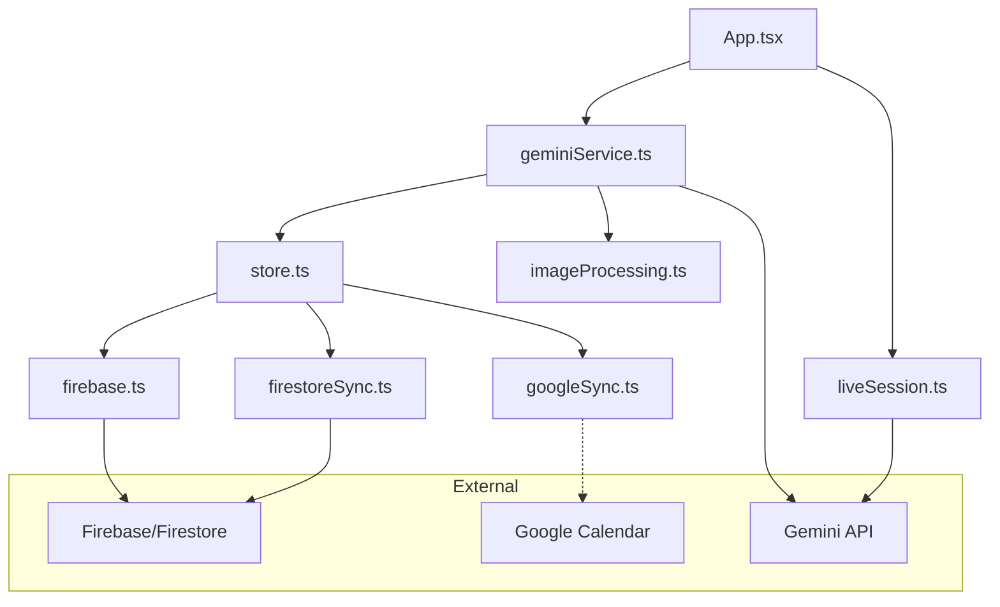

# Services Reference

This document provides detailed documentation for all service modules in Flowmate.

---

## Service Overview

| Service | File | Purpose |
|---------|------|---------|
| **Gemini Service** | `geminiService.ts` | AI orchestration and text processing |
| **Firebase** | `firebase.ts` | Authentication and Firebase config |
| **Firestore Sync** | `firestoreSync.ts` | Cloud data persistence |
| **Google Sync** | `googleSync.ts` | Calendar synchronization adapter |
| **Live Session** | `liveSession.ts` | Real-time voice AI |

---

## 1. Gemini Service (`geminiService.ts`)

### Overview
Central AI orchestration service that interfaces with Google's Gemini API for natural language understanding and graph manipulation.

### Key Features (Updated Dec 2025)
- **Timezone-Aware Dates**: AI outputs dates with user's timezone offset (e.g., `+05:30` for IST) instead of UTC `Z`
- **Context/Tag System**: Improved prompts for proper CONTEXT vs TAG entity creation
- **Tool Calling**: Uses `apply_changes` and `read_calendar` function tools

### Functions

#### `orchestrateMessage()`
Main AI orchestration function that converts natural language to TOON operations.

**Context Selection**:
- Recent: Last 15 updated entities
- Relevant: Top 10 by relevance score

**Temporal Context**:
```typescript
const temporalContext = {
    iso: now.toISOString(),
    local_display: now.toLocaleString('en-US', { timeZone: userTimezone }),
    weekday: now.toLocaleString('en-US', { weekday: 'long', timeZone: userTimezone }),
    date: now.toLocaleDateString('en-US', { timeZone: userTimezone })
};
```

#### `generateBriefing()`
Generate AI daily briefing with focus areas, schedule highlights, and quick wins.

#### `improveText()`
AI-powered text improvement for SmartEditor (grammar, professional, expand, summarize).

#### `queryKnowledgeBase()`
RAG-style Q&A over user's notes, topics, courses, projects, and contexts.

---

## 2. Firebase Service (`firebase.ts`)

### Overview
Firebase initialization and authentication functions.

### Configuration
Uses Vite environment variables:
```typescript
VITE_FIREBASE_API_KEY
VITE_FIREBASE_AUTH_DOMAIN
VITE_FIREBASE_PROJECT_ID
VITE_FIREBASE_STORAGE_BUCKET
VITE_FIREBASE_MESSAGING_SENDER_ID
VITE_FIREBASE_APP_ID
```

### Authentication Functions

| Function | Description |
|----------|-------------|
| `signInWithEmail(email, password)` | Email/password sign in |
| `signUpWithEmail(email, password)` | Create new account |
| `signInWithGoogle()` | Google OAuth popup |
| `signOut()` | Sign out current user |
| `onAuthChange(callback)` | Auth state observer |
| `isFirebaseConfigured()` | Check if config is valid |

---

## 3. Firestore Sync Service (`firestoreSync.ts`)

### Overview
Handles syncing entities and relationships to/from Firestore.

### Data Structure
```
users/{userId}
├── entities: Entity[]
├── relationships: Relationship[]
├── universalTags: TagDefinition[]
└── lastSyncedAt: Timestamp
```

### Functions

| Function | Description |
|----------|-------------|
| `loadUserData(userId)` | Load user's graph from Firestore |
| `saveUserData(userId, data)` | Save entities/relationships to Firestore |
| `syncOperation(userId, op, data)` | Sync single operation (currently full sync) |
| `mergeData(local, remote)` | Merge strategy: server wins for conflicts |
| `deleteUserData(userId)` | Clear user's data |

---

## 4. Google Sync Service (`googleSync.ts`)

### Overview
Adapter for synchronizing events with Google Calendar. **Currently simulated** (no real API calls).

### Handled Operations
- `schedule_event`
- `update_entity` (if target is EVENT)
- `delete_entity`

---

## 5. Live Session Service (`liveSession.ts`)

### Overview
Manages real-time bidirectional voice AI sessions using Gemini's Live API.

### Audio Configuration

| Direction | Sample Rate | Format |
|-----------|-------------|--------|
| Input (mic) | 16 kHz | PCM 16-bit |
| Output (speaker) | 24 kHz | PCM 16-bit |

### Available Tools
- `create_entity` - Create new items via voice
- `log_activity` - Log completed work

---

## 6. Image Processing Utility (`utils/imageProcessing.ts`)

| Function | Purpose |
|----------|---------|
| `processImageAttachment()` | Compress images to max 1024×1024 |
| `processFileAttachment()` | Generic file processor |
| `stripBase64Prefix()` | Remove DataURL prefix |
| `getMimeType()` | Extract MIME type |

---

## Service Dependencies



---

## Error Handling

| Service | Pattern |
|---------|---------|
| geminiService | Try-catch, return empty ops + error message |
| firebase | Return `{ user, error }` or `{ error }` |
| firestoreSync | Return boolean success, log errors |
| liveSession | Status callbacks, cleanup on error |
| googleSync | Return `{ success: false, error }` |
